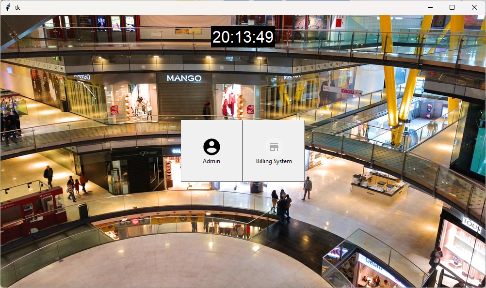
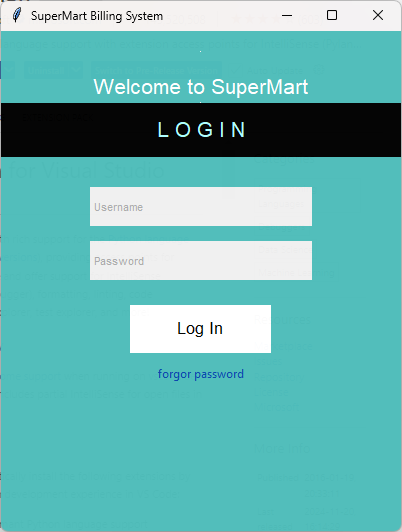
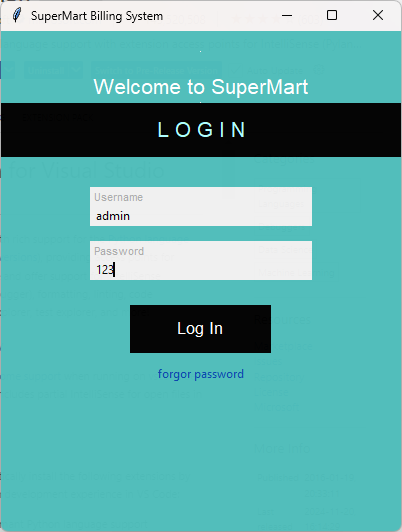
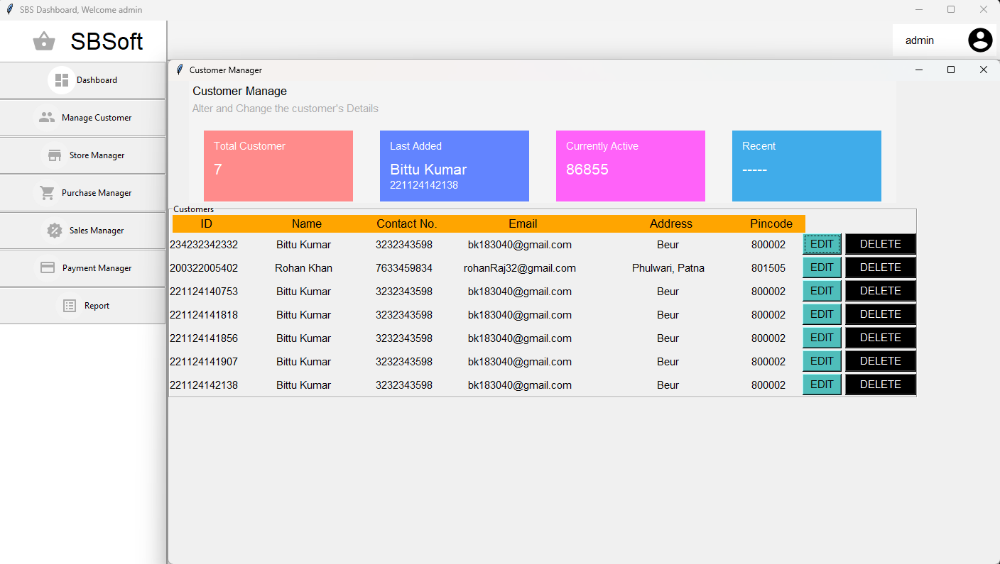
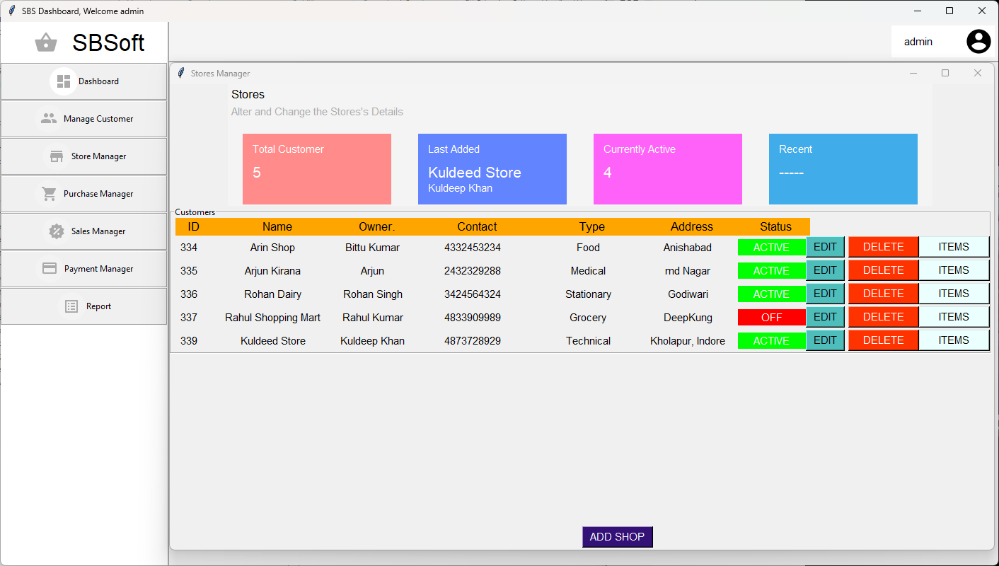
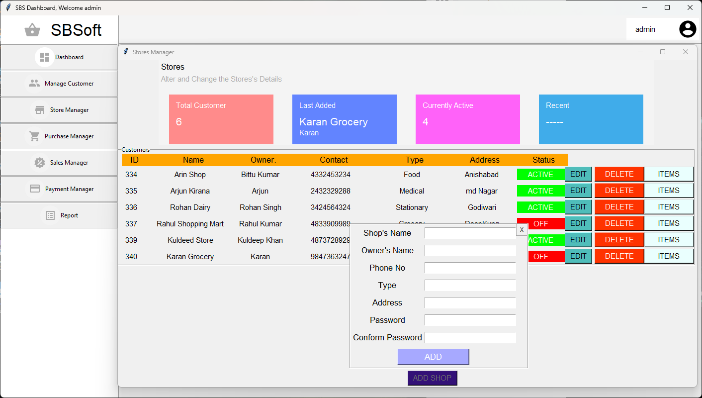
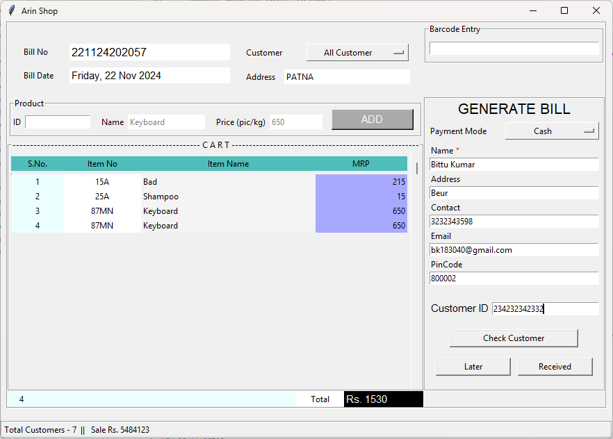
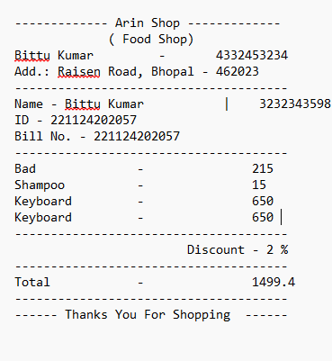

## Supermart Management System
This project allow supermart to manage there stores and the product each store have.

#### Start the Project:
###### How to Start in Development:

```sh
git clone https://github.com/BittuKumar183040/ShopWithUs.git
cd sms
```

###### Create Virtual Environment
```
python -m venv venv
pip install -r .\requirements.txt
```
###### Setup Database Locally
> import <span style="color:blue">some *blue* text</span>../sbs_Db/sbs.sqp </span>file in sql application

###### Run Project
```
python main.py
```

> #
>> ###### For Distribution
> Created dist file directory which contain <strong>main.exe</strong> which can start directly.
> #

##### Functional Architecture:


##### Database Structure:


---
### Screenshots

##### Main Screen


##### Admin Login 
<div class="text-center">
    
    
</div>

----
##### After Sucessfully logged in the is the admin dashboard.







---

##### Billing Dashboard



---

###### After Payment Received custormer can have the receipt. 



